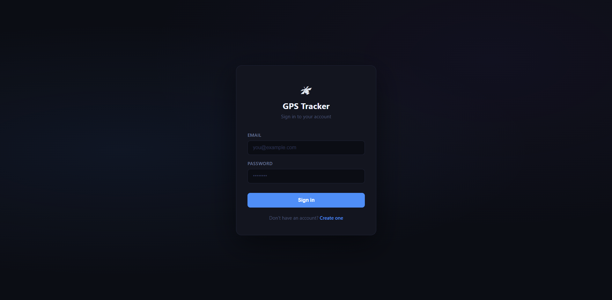
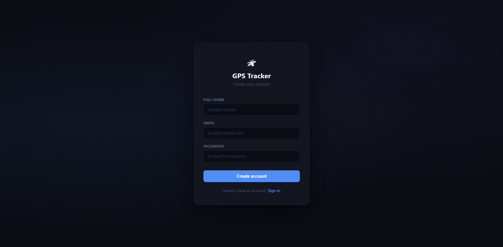
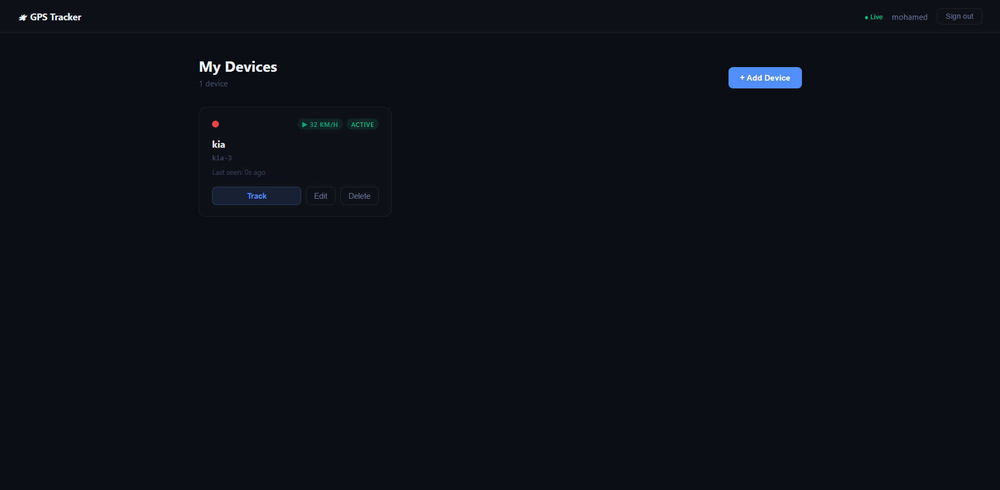
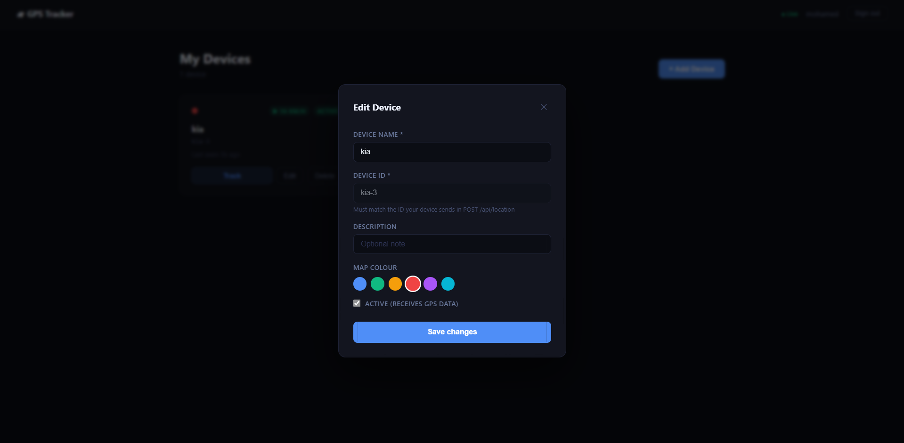
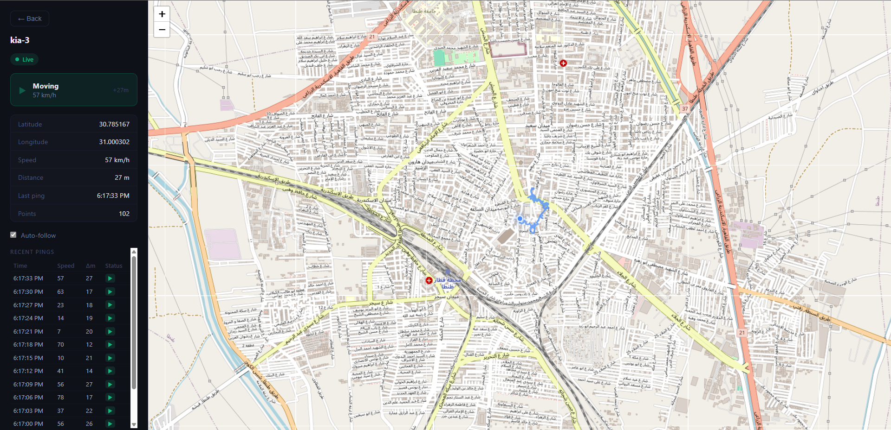

# GPS Tracker

A full-stack real-time GPS tracking web application built with ExpressJS, Socket.io, Leaflet, MongoDB and Angular 21.

---

## Screenshots








---

## Overview

GPS Tracker is a web-based application that displays live device locations on an interactive map.

The backend exposes a REST/WebSocket API for receiving and serving location data, with secure access handled via JWT-based authentication. The frontend renders real-time markers on a map interface.

## The two components are fully decoupled and can be deployed independently.

## Tech Stack

| Layer     | Technology         |
| --------- | ------------------ |
| Backend   | Node.js, ExpressJS |
| Database  | MongoDB            |
| Frontend  | Angular 21         |
| Real-time | WebSockets         |
| Maps      | Leaflet            |

---

## Installation

### Prerequisites

- Node.js v18+
- npm

### Backend

```bash
cd backend
npm install
```

Create a `.env` file in the `backend/` directory:

```env
PORT=           # Server port
MONGO_URI=      # MongoDB connection string
CLIENT_URL=     # Frontend URL (for CORS)
BASE_URL=       # Backend base URL
JWT_SECRET=     # Secret key for JWT authentication
```

### Frontend

```bash
cd frontend
npm install
```

---

## Running the App

### Backend

```bash
cd backend
npm run dev        # development
```

The server will be available at `http://localhost:3000`.

### Frontend

```bash
cd frontend
ng serve
```

Open `http://localhost:4200` in your browser.

---
